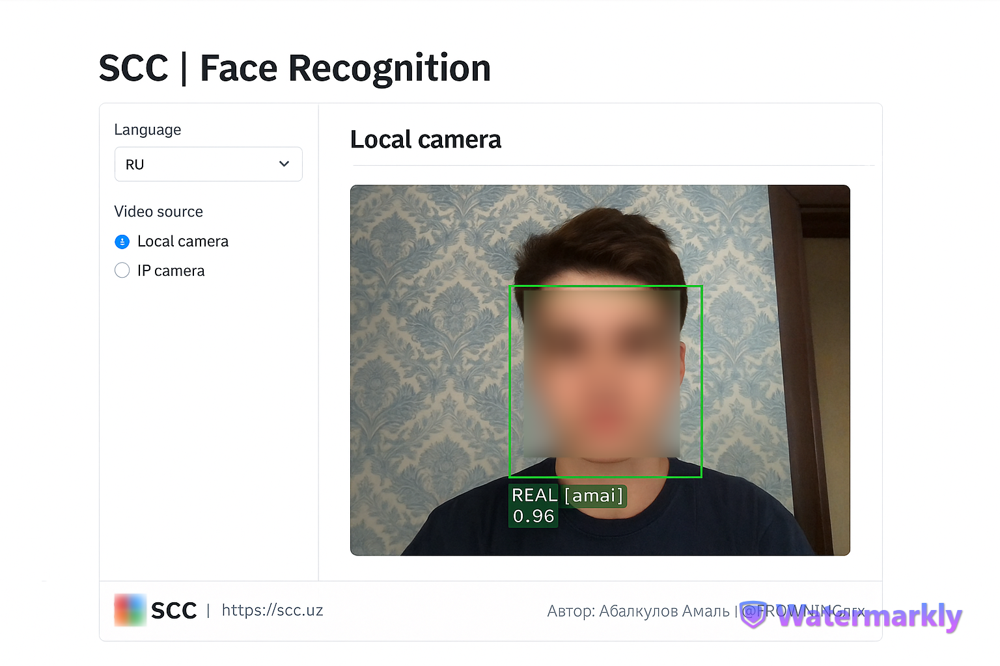

# Программа для распознавания лиц с антиспуфингом

Это серверное приложение на **FastAPI**, выполняющее **распознавание лиц в реальном времени** с защитой от подделки (антиспуфинг).  
Поддерживается работа как с локальной, так и с IP-камерой — подходит для систем контроля доступа, логирования входов и других задач.

---

## 🔧 Возможности

- Обнаружение лиц с помощью YOLOv5 (ONNX)
- Проверка реальности лица с помощью модели антиспуфинга
- Распознавание лиц по базе изображений (`face_db`)
- REST API — легко интегрируется с фронтендом и внешними системами
- Поддержка локальной и IP-камеры
- Ведение логов и сохранение снимков
- Поддержка HTTPS (сертификаты в папке `OpenSSL`)



---

## 🧠 Как это работает

1. Сервер принимает изображение (или поток) с камеры.
2. С помощью YOLOv5 определяется лицо.
3. Лицо передаётся в антиспуфинг-модель.
4. Если лицо признано настоящим — выполняется распознавание.
5. В ответе API возвращаются имя пользователя и статус: **REAL / FAKE / UNKNOWN**.

---

## 📁 Структура проекта

```
SCC/
├── video_predict.py               # Основной сервер FastAPI
├── data_preparation.py           # Подготовка изображений для face_db
├── src/
│   ├── face_detector/YOLO.py     # Детекция лиц (YOLOv5 ONNX)
│   ├── FaceAntiSpoofing.py       # Проверка подлинности лица
│   └── ...                       # Прочие вспомогательные модули
├── saved_models/                 # Весовые файлы моделей
│   ├── yolov5s-face.onnx
│   └── AntiSpoofing_bin_1.5_128.onnx
├── face_db/                      # База изображений лиц
│   └── amal.jpg
├── static/                       # Иконки, логотипы и прочее
├── assets/                       # Примеры изображений / демо
├── frontend/                     # Фронтенд (если используется)
├── logs/                         # Логи, снимки, детекты
├── OpenSSL/                      # SSL-сертификаты
└── README.md                     # Документация проекта
```

---

## ⚙️ Установка

> ❗ Требуется Python **3.9**  
> 💡 Для ускорения работы можно использовать GPU и библиотеку `onnxruntime-gpu`

```bash
# Клонирование репозитория
git clone https://github.com/your-username/face-antispoofing.git
cd SCC

# Создание и активация окружения
conda create -n face-env python=3.9
conda activate face-env

# Установка зависимостей
pip install -r requirements.txt

# (Для GPU-ускорения)
pip install onnxruntime-gpu
```

---

## ▶️ Запуск сервера

```bash
python video_predict.py
```

Сервер будет доступен по адресу:

- 🔗 **https://<ваш IP>:8000**

---

## 🎥 Режимы работы

### 1. Локальная камера

- Захват видео с веб-камеры (`cv2.VideoCapture(0)`)

### 2. IP-камера (например, Android)

- Используйте приложение [IP Webcam](https://play.google.com/store/apps/details?id=com.pas.webcam)
- Пример URL потока:
  ```
  http://192.168.1.101:8080/video
  ```

---

## 🗂 Добавление новых лиц

Чтобы система распознавала новое лицо:

1. Поместите изображение в папку `face_db/`
2. Назовите файл по имени пользователя, например:

```
face_db/amal.jpg
```

---

## 📸 Поддерживаемые форматы изображений

- `.jpg`
- `.jpeg`
- `.png`

---

## 📦 Зависимости

- `fastapi`
- `uvicorn`
- `opencv-python`
- `face_recognition`
- `onnxruntime` / `onnxruntime-gpu`
- `numpy`
- `Pillow`

Создание `requirements.txt`:

```bash
pip freeze > requirements.txt
```

---

## ✍️ Автор

Разработка и дизайн: **Абалкулов Амаль**  
📬 Telegram: [@FROWNINGnrx](https://t.me/FROWNINGnrx)

---

## ✅ Планы по доработке

- [ ] Онлайн регистрация лиц через интерфейс
- [ ] Ведение истории входов и логирование
- [ ] Режим администратора для управления базой лиц
- [ ] Уведомления в Telegram при входе
- [ ] Оптимизация для слабых устройств (Raspberry Pi и др.)

---

## 📄 Лицензия

Проект распространяется под лицензией **MIT License**.  
Вы можете свободно использовать, распространять и модифицировать код.

---

## 🛠 Обратная связь

Если вы нашли баг или хотите предложить улучшение — напишите автору в Telegram.
