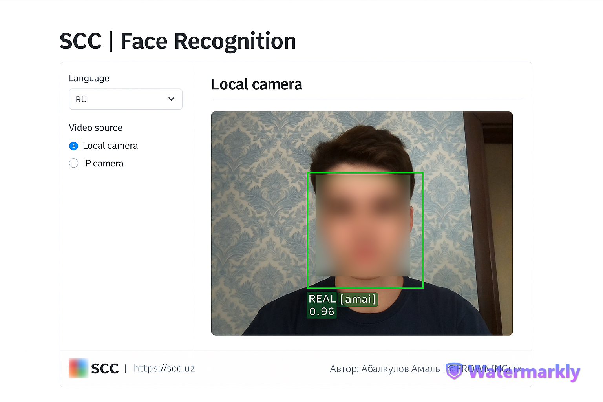

# Программа для распознавания лица

Это Streamlit-приложение выполняет **распознавание лиц в реальном времени** с защитой от подделки (антиспуфинг).  
Программа может работать как с локальной камерой, так и с IP-камерой — подходит для контроля доступа, регистрации входа и других задач.

---

## 🔧 Возможности

- Обнаружение лица с помощью модели YOLOv5 (ONNX)
- Проверка реальности лица с помощью модели AntiSpoofing
- Распознавание лиц по базе изображений (`student_db`)
- Интерфейс Streamlit с боковой панелью и логотипом
- Поддержка подключения по локальной и IP-камере
- Оптимизированный вывод видео в окне браузера
- Адаптивный дизайн (поддержка мобильных устройств)
- Авторская панель с подписью


---

## 🧠 Как это работает

1. Захватывается изображение с камеры (веб или IP).
2. Определяется лицо с помощью YOLOv5.
3. Фрагмент лица подаётся в антиспуфинг-модель.
4. Если лицо настоящее — проводится сравнение с базой.
5. На экран выводится имя пользователя и статус: REAL / FAKE / UNKNOWN.

---

## 📁 Структура проекта

```
Face-AntiSpoofing-main/
├── streamlit_app.py               # Основной интерфейс Streamlit
├── src/
│   ├── face_detector/YOLOv5.py    # Модуль для распознавания лица
│   └── FaceAntiSpoofing.py        # Модуль антиспуфинга
├── saved_models/
│   ├── yolov5s-face.onnx          # Модель YOLOv5
│   └── AntiSpoofing_bin_1.5_128.onnx
├── student_db/                    # База данных лиц (изображения)
│   └── имя_пользователя.jpg
├── static/
│   └── logo.png                   # Логотип для боковой панели
└── README.md
```

---

## ⚙️ Установка

Требуется Python 3.9 и наличие CUDA (если планируется использовать GPU).

```bash
# Клонируйте проект
git clone https://github.com/your-username/face-antispoofing.git
cd face-antispoofing

# Создайте и активируйте виртуальное окружение
conda create -n face-env python=3.9
conda activate face-env

# Установите зависимости
pip install -r requirements.txt

# (Для GPU)
pip install onnxruntime-gpu
```

---

## ▶️ Запуск

```bash
streamlit run streamlit_app.py
```

После запуска интерфейс будет доступен по адресу:
- Локально: http://localhost:8501
- С телефона (в сети): http://<ваш IP>:8501

---

## 🎥 Режимы работы

### 1. Локальная камера
- Используется веб-камера вашего компьютера
- Не требует ввода IP

### 2. Подключение по IP
- Можно использовать Android-приложение [IP Webcam](https://play.google.com/store/apps/details?id=com.pas.webcam)
- Пример URL:
```
http://192.168.1.101:8080/video
```

---

## 🗂 Добавление новых лиц

Чтобы система распознавала ваше лицо:

1. Поместите фото лица в папку `student_db/`
2. Назовите файл по имени пользователя, например:
```
student_db/amal.jpg
```

---

## 📸 Поддерживаемые форматы

- `.jpg`
- `.jpeg`
- `.png`

---

## 📦 Зависимости

- `streamlit`
- `opencv-python`
- `face_recognition`
- `onnxruntime` / `onnxruntime-gpu`
- `numpy`
- `Pillow`

Файл `requirements.txt` можно сформировать так:

```bash
pip freeze > requirements.txt
```

---

## ✍️ Автор

Разработка и дизайн: **Абалкулов Амаль**  
Telegram: [@FROWNINGnrx](https://t.me/FROWNINGnrx)

---

## ✅ Идеи для доработки

- [ ] Онлайн регистрация лиц через интерфейс
- [ ] Сохранение истории входов и логов
- [ ] Режим администратора для управления базой
- [ ] Интеграция уведомлений через Telegram
- [ ] Оптимизация под слабые устройства

---

## 📄 Лицензия

Проект распространяется под лицензией **MIT License**.  
Вы можете использовать, распространять и изменять код без ограничений.

---

Если вы нашли баг или хотите предложить улучшение — пишите автору в Telegram.
